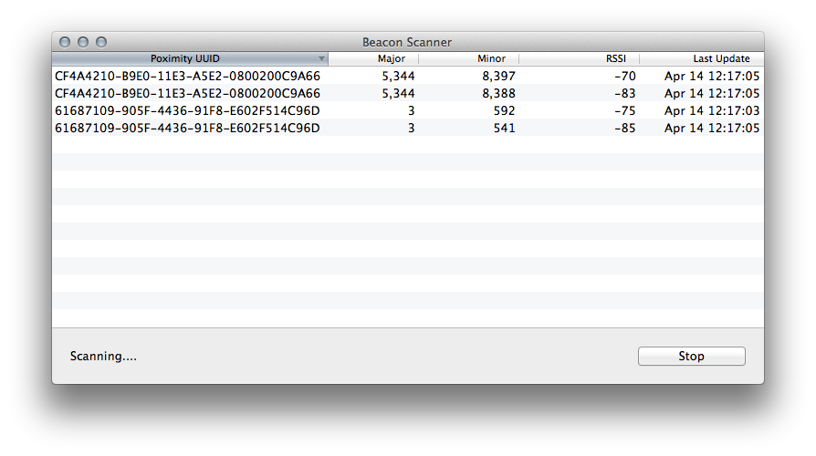

BeaconScanner
=============

iBeacon Scanning Utility for OSX

One oversight when apple introduced iBeacons in iOS was a lack of API support for OSX.  Because of this, developing and testing for iBeacons has generally required using an iOS device.  This application allows doing so with on desktop, and the source code provides a means to add iBeacon support any other OSX project, as well.

###Installing

To install without building from source, first [download the prebuilt archive](Builds/BeaconScanner.zip).  Double click the zip to extract, and then double click again to run. 

Once you start the app it'll automatically begin scanning for bluetooth devices.  Any beacons within range will automatically appear and it will continuously update as long as it remains scanning.

###Building

Building the app requires [cocoapods](http://cocoapods.org).  Once installed, launch Terminal.app and in the project directory, run "pod install".  When it completes, open the *BeaconScanner.xcworkspace* file that it create in Xcode.  The app should then build and run successfully. 

###Adding beacon support to your own project

To add iBeacon support to your own desktop application (at least until the a proper cocoapod is made available), just copy the following four files into your project:  

- BCBeaconManager.h
- BCBeaconManager.m
- BCBeacon.h
- BCBeacon.m

The beacon manager announces the beacons it detects to the subscribers of the [ReactiveCocoa](https://github.com/ReactiveCocoa/ReactiveCocoa) signal that it provides for this.  

All that's needed for a client to detect beacons is to subscribe to this signal:

	[[[HGBeaconManager] sharedBeaconManager] startScanning];
	
	RACSignal *beaconSignal = [[HGBeaconManager sharedBeaconManager] beaconSignal];
	[beaconSignal subscribeNext:^(HGBeacon *detectedBeacon) {
		NSLog(@"iBeacon Detected: %@", )
	}];

To limit this subscription to just those beacons that are relevant to your application, a filtered signal can be composed from the raw feed, like so:

	NSUUID *applicationUUID = [[NSUUID alloc] initWithUUIDString:@"B9407F30-F5F8-466E-AFF9-25556B57FE6D"]

	RACSignal *filteredSignal = [[[HGBeaconManager sharedBeaconManager] beaconSignal] filter:^(HGBeacon *beacon) {
		return [beaconSignal.proximityUUID isEqual:applicationUUID];
	}];
	

Note that as long as any given beacon is in range, it will be announced periodically via the subscription.  

It's best to use these updates to maintain a seperate list of nearby active beacons, and then periodically purge from this list those that have not been heard from in a while in order to ensure that only active beacons are tracked.   

In the application source, the class *HGBeaconViewController* provides a good example of how to do this. 

### The Icon

The "Radar" image in the icon was created by [ricaodomaia](http://openclipart.org/user-detail/ricardomaia) and downloaded from [openclipart.org](http://openclipart.org/detail/122719/radar-by-ricardomaia) 